Note that the original document is provided under the license of GPL-2 and the copyright belongs to Hadley Wickham, one of the authors of [ggplot2](https://github.com/hadley/ggplot2).
---------------------------------------------------------------------------------------------------------------------------------------------------------------------------------------

このvignetteには、ggplot2 2.0.0で公式に提供される拡張メカニズムについて書きます。 このvignetteは、`?Stat`や`?Geom`や`?theme`で読むことができる低レベルな詳細をまとめたものです。 新しいstat、geom、themeをつくってggplot2を拡張する方法を身に着けることができるでしょう。

これを読み進めるにつれてあなたは、頭を掻きむしり、いったいなぜこんなふうにつくったんだ？と首をかしげるものをたくさん目にするでしょう。 それらの多くは、歴史的経緯です。ggplot2の開発を始めたころ私はあまりよいRのプログラマではありませんでした。 私たちは2.0.0のリリースで可能な限り多くの問題を解決しましたが、苦労もむなしくうまく修正できないものもありました。

ggproto
-------

すべてのggplot2のオブジェクトは、ggprotoのオブジェクト指向プログラミングシステムを使って作られています。

このオブジェクト指向システムはたったひとつの場所でしか使われていません。それは、ggplot2です。 これはほとんどが歴史的経緯です。ggplot2はmutableなオブジェクトのために[proto](https://cran.r-project.org/package=proto)を使って始まりました。これは（短命だった）[mutatr](http://vita.had.co.nz/papers/mutatr.html)や参照クラスやR6よりずっと昔の話です。protoだけが唯一の選択肢だったのです。

でもそれでは、なぜggprotoなのでしょう。 ggplot2の公式の拡張メカニズムを追加しようとしたとき、私たちは大きな問題に気付きました。protoオブジェクトが別のパッケージで拡張されていると問題が起こるのです（メソッドはその拡張が追加されたパッケージではなくggplot2パッケージで評価されます）。R6に切り替えようと試みましたが、ggplot2の要求と合致しませんでした。 protoを改造することもできましたが、そうすると、まずprotoがどのように機能するかを正確に理解することになり、さらにその変更がprotoの他のユーザーに影響を与えないことを確認しなくてはいけなくなります。

おかしな話ですが、これは、新しいオブジェクト指向を発明するというのが問題に対する正しい答えだったケースです！ 幸運にもWinstonはオブジェクト指向システムをつくるのにとても長けていて、たった1日でggprotoを思いつきました。ggprotoはggplot2が必要とするprotoの機能をすべて保持し、一方でパッケージ間にまたがる継承もうまく機能させます。

以下はggprotoの簡単な使用例です。

``` r
A <- ggproto("A", NULL,
  x = 1,
  inc = function(self) {
    self$x <- self$x + 1
  }
)
A$x
```

    #> [1] 1

``` r
A$inc()
A$x
```

    #> [1] 2

``` r
A$inc()
A$inc()
A$x
```

    #> [1] 4

ggplot2のクラスの多くはイミュータブルで静的です。つまり、そのメソッドはクラスの中で状態を使うことも変化させることもしません。これらのクラスはほとんどの場合、関連するメソッドをまとめるのに便利な方法として使われています。

新しいgeomやstatをつくるには、これから説明するように`Stat`や`Geom`を継承して新しいggprotoをつくってそのメソッドをオーバーライドするだけです。

新しいstatをつくる
------------------

### もっとも単純なstat

とても単純なstatをつくることから始めます。点の集合の凸包を得るstatです。まず、`Stat`を継承するggprotoオブジェクトをつくります。

``` r
StatChull <- ggproto("StatChull", Stat,
  compute_group = function(data, scales) {
    data[chull(data$x, data$y), , drop = FALSE]
  },
  
  required_aes = c("x", "y")
)
```

もっとも重要な部分は、`compute_group()`メソッド（計算を実行します）と`required_aes`フィールド（このstatが動くのに存在しなければいけないaestheticsをリストアップします）です。

次に、layer関数を書きます。不幸にも、早期の設計ミスにより私はこれらを`stat_()`や`geom_()`と名付けてしまいました。`layer_()`関数とするべきでした。これはより実体に即した表記です。なぜなら、すべてのレイヤーがstatにもgeomにも関わっているからです。

すべてのlayer関数は同じ形式に従います。関数の引数にデフォルト引数を設定して、`layer()`を呼び、`...`をその`param`引数に渡します。 `...`に含まれる引数は、geomの引数（statのラッパーの場合）かstatの引数（geomのラッパーの場合）かセットするaestheticsのいずれかです。`layer()`が、異なるパラメータを分離して正しい場所に格納することの面倒を見てくれます。

``` r
stat_chull <- function(mapping = NULL, data = NULL, geom = "polygon",
                       position = "identity", na.rm = FALSE, show.legend = NA, 
                       inherit.aes = TRUE, ...) {
  layer(
    stat = StatChull, data = data, mapping = mapping, geom = geom, 
    position = position, show.legend = show.legend, inherit.aes = inherit.aes,
    params = list(na.rm = na.rm, ...)
  )
}
```

（注：もし自分のパッケージの中でこれを書くなら、`ggplot2::layer()`と明示的に呼ぶか、`layer()`関数をパッケージの名前空間にインポートするか、いずれかを行う必要があります）

いったんlayer関数を手にすれば、新しいstatを試すことができるようになります。

``` r
ggplot(mpg, aes(displ, hwy)) + 
  geom_point() + 
  stat_chull(fill = NA, colour = "black")
```

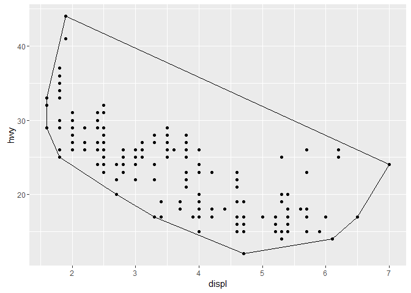

（`fill=NA`と毎回指定しなくてもいいようにgeomのデフォルトを変更する方法は後ほど出てきます）

ひとたびこの基本的なオブジェクトを書き上げると、ggplot2が提供するたくさんの機能を自由に使えるようになります。例えば、ggplot2はそれぞれのグループで固定のaestheticsを自動で保存してくれます。

``` r
ggplot(mpg, aes(displ, hwy, colour = drv)) + 
  geom_point() + 
  stat_chull(fill = NA)
```

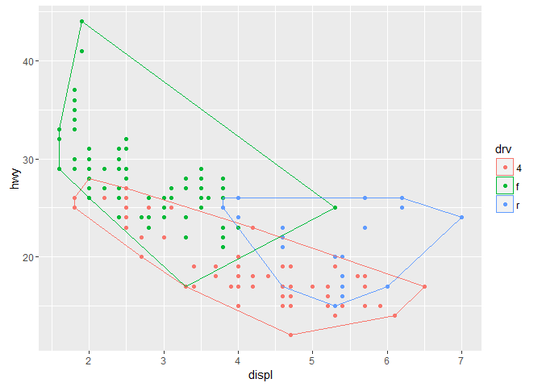

凸包を別の方法で表示するようにデフォルトのgeomをオーバーライドすることもできます。

``` r
ggplot(mpg, aes(displ, hwy)) + 
  stat_chull(geom = "point", size = 4, colour = "red") +
  geom_point()
```

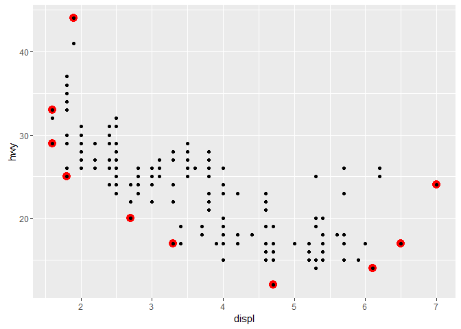

### Statのパラメータ

さらに複雑なstatはいくつかの計算を行います。プロットにもっともフィットする線を追加する、簡単なバージョンの`geom_smooth()`を実装してみましょう。`Stat`を継承した`StatLm`とlayer関数`stat_lm()`をつくります。

``` r
StatLm <- ggproto("StatLm", Stat, 
  required_aes = c("x", "y"),
  
  compute_group = function(data, scales) {
    rng <- range(data$x, na.rm = TRUE)
    grid <- data.frame(x = rng)
    
    mod <- lm(y ~ x, data = data)
    grid$y <- predict(mod, newdata = grid)
    
    grid
  }
)

stat_lm <- function(mapping = NULL, data = NULL, geom = "line",
                    position = "identity", na.rm = FALSE, show.legend = NA, 
                    inherit.aes = TRUE, ...) {
  layer(
    stat = StatLm, data = data, mapping = mapping, geom = geom, 
    position = position, show.legend = show.legend, inherit.aes = inherit.aes,
    params = list(na.rm = na.rm, ...)
  )
}

ggplot(mpg, aes(displ, hwy)) + 
  geom_point() + 
  stat_lm()
```

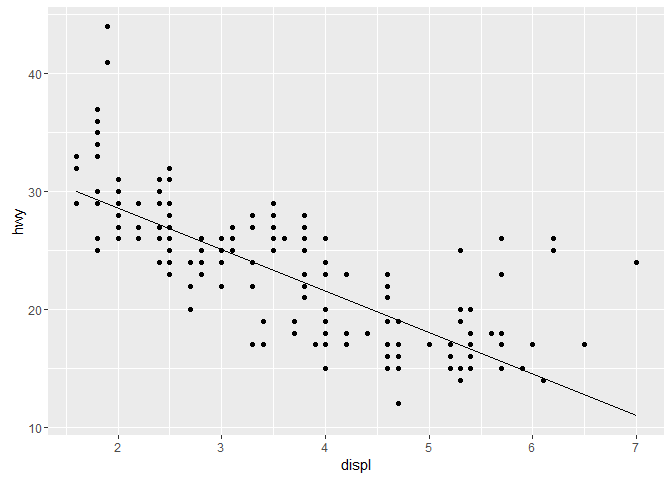

`StatLm`はパラメータを持たないため柔軟性がありません。モデルの式やグリッドを生成するのに使われる点の数をユーザーが操作できるようにしたい、と思うかもしれません。そうするには、`compute_group()`メソッドと先ほどのラッパー関数に引数を追加します。

``` r
StatLm <- ggproto("StatLm", Stat, 
  required_aes = c("x", "y"),
  
  compute_group = function(data, scales, params, n = 100, formula = y ~ x) {
    rng <- range(data$x, na.rm = TRUE)
    grid <- data.frame(x = seq(rng[1], rng[2], length = n))
    
    mod <- lm(formula, data = data)
    grid$y <- predict(mod, newdata = grid)
    
    grid
  }
)

stat_lm <- function(mapping = NULL, data = NULL, geom = "line",
                    position = "identity", na.rm = FALSE, show.legend = NA, 
                    inherit.aes = TRUE, n = 50, formula = y ~ x, 
                    ...) {
  layer(
    stat = StatLm, data = data, mapping = mapping, geom = geom, 
    position = position, show.legend = show.legend, inherit.aes = inherit.aes,
    params = list(n = n, formula = formula, na.rm = na.rm, ...)
  )
}

ggplot(mpg, aes(displ, hwy)) + 
  geom_point() + 
  stat_lm(formula = y ~ poly(x, 10)) + 
  stat_lm(formula = y ~ poly(x, 10), geom = "point", colour = "red", n = 20)
```


注意すべき点として、新しいパラメータを明示的にlayerの引数に含めることは、必ずやらなくてはいけないわけではありません。いずれにせよ`...`は正しい位置に渡されます。しかし、ユーザーがそれについて知ることができるようにどこかにドキュメントを書く必要はあるでしょう。 ここに短い例があります。`@inheritParams ggplot2::stat_identity`は、`stat_identity()`について定義されたすべてのパラメータについてのドキュメントを自動的に継承してくれます。

``` r
#' @inheritParams ggplot2::stat_identity
#' @param formula The modelling formula passed to \code{lm}. Should only 
#'   involve \code{y} and \code{x}
#' @param n Number of points used for interpolation.
stat_lm <- function(mapping = NULL, data = NULL, geom = "line",
                    position = "identity", na.rm = FALSE, show.legend = NA, 
                    inherit.aes = TRUE, n = 50, formula = y ~ x, 
                    ...) {
  layer(
    stat = StatLm, data = data, mapping = mapping, geom = geom, 
    position = position, show.legend = show.legend, inherit.aes = inherit.aes,
    params = list(n = n, formula = formula, na.rm = na.rm, ...)
  )
}
```

### デフォルト値を使う

場合によっては、それぞれのデータに対して一度づつではなく、データセット全体に行うべき計算があります。 これは、理にかなったデフォルト値を選ぶのに役立ちます。例えば、密度推定を行いたいとき、プロット全体に対してひとつのバンド幅を選ぶのは妥当なことでしょう。 以下のStatは、それぞれのグループに最適なバンド幅の平均を全グループのバンド幅として使う（この方法に論理的な根拠はありませんが、非合理的ではなさそうに見えます）、`stat_density()`の一種をつくります。

そうするためには、`setup_param()`メソッドをオーバーライドします。これは、データとパラメータのリストを渡すと更新されたリストを返します。

``` r
StatDensityCommon <- ggproto("StatDensityCommon", Stat, 
  required_aes = "x",
  
  setup_params = function(data, params) {
    if (!is.null(params$bandwidth))
      return(params)
    
    xs <- split(data$x, data$group)
    bws <- vapply(xs, bw.nrd0, numeric(1))
    bw <- mean(bws)
    message("Picking bandwidth of ", signif(bw, 3))
    
    params$bandwidth <- bw
    params
  },
  
  compute_group = function(data, scales, bandwidth = 1) {
    d <- density(data$x, bw = bandwidth)
    data.frame(x = d$x, y = d$y)
  }  
)

stat_density_common <- function(mapping = NULL, data = NULL, geom = "line",
                                position = "identity", na.rm = FALSE, show.legend = NA, 
                                inherit.aes = TRUE, bandwidth = NULL,
                                ...) {
  layer(
    stat = StatDensityCommon, data = data, mapping = mapping, geom = geom, 
    position = position, show.legend = show.legend, inherit.aes = inherit.aes,
    params = list(bandwidth = bandwidth, na.rm = na.rm, ...)
  )
}

ggplot(mpg, aes(displ, colour = drv)) + 
  stat_density_common()
```

    #> Picking bandwidth of 0.345

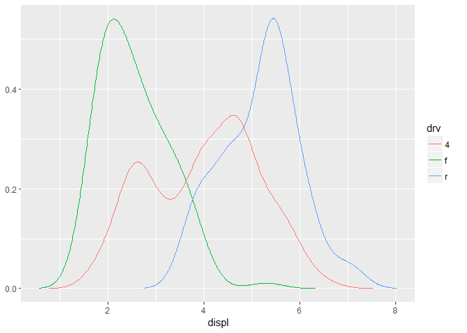

``` r
ggplot(mpg, aes(displ, colour = drv)) + 
  stat_density_common(bandwidth = 0.5)
```

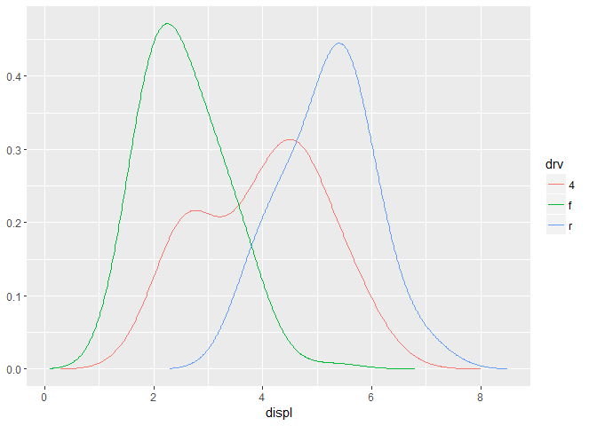

私は`NULL`をデフォルト値にすることをお薦めします。もしも重要なパラメータを自動で選ぶのであれば、`message()`でユーザーに伝えるのがいいでしょう。(あと、浮動小数点のパラメータを表示するときは`signif()`を使って数桁だけを見せるのがいいでしょう)

### 変数名とデフォルトのaesthetics

以下のstatは別の重要な点を示しています。もしも他のgeomといっしょにこのstatを使いたい場合は、`y`ではなく`density`という名前の変数を返すべきです。 そうすることで、`density`を`y`に自動的にマップするように`default_aes`を設定することができます。ユーザーはこのaestheticsをオーバーライドして別のgeomで使うことができます。

``` r
StatDensityCommon <- ggproto("StatDensity2", Stat, 
  required_aes = "x",
  default_aes = aes(y = ..density..),

  compute_group = function(data, scales, bandwidth = 1) {
    d <- density(data$x, bw = bandwidth)
    data.frame(x = d$x, density = d$y)
  }  
)

ggplot(mpg, aes(displ, drv, colour = ..density..)) + 
  stat_density_common(bandwidth = 1, geom = "point")
```

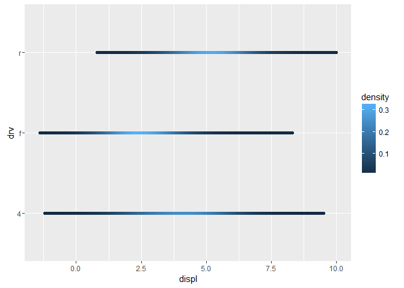

しかし、このstatをareaのgeomと組み合わせると正しく動作しません。面が積み重なっていません。

``` r
ggplot(mpg, aes(displ, fill = drv)) + 
  stat_density_common(bandwidth = 1, geom = "area", position = "stack")
```

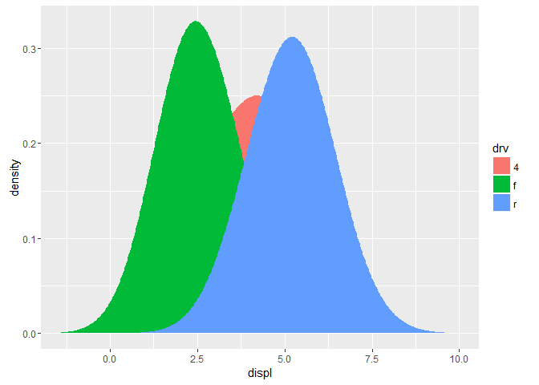

これはなぜかというと、各グループの密度が別々に計算されていて`x`の推定値が含まれていないからです。この問題は、`setup_param()`で一度だけデータの範囲を計算するようにすることで解決できます。

``` r
StatDensityCommon <- ggproto("StatDensityCommon", Stat, 
  required_aes = "x",
  default_aes = aes(y = ..density..),

  setup_params = function(data, params) {
    min <- min(data$x) - 3 * params$bandwidth
    max <- max(data$x) + 3 * params$bandwidth
    
    list(
      bandwidth = params$bandwidth,
      min = min,
      max = max,
      na.rm = params$na.rm
    )
  },
  
  compute_group = function(data, scales, min, max, bandwidth = 1) {
    d <- density(data$x, bw = bandwidth, from = min, to = max)
    data.frame(x = d$x, density = d$y)
  }  
)

ggplot(mpg, aes(displ, fill = drv)) + 
  stat_density_common(bandwidth = 1, geom = "area", position = "stack")
```

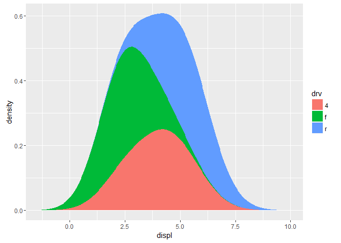

``` r
ggplot(mpg, aes(displ, drv, fill = ..density..)) + 
  stat_density_common(bandwidth = 1, geom = "raster")
```

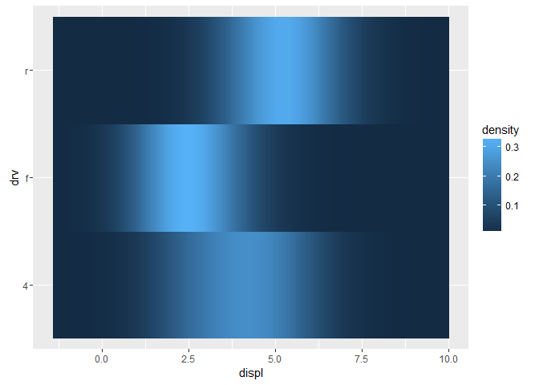

### Exercises

1.  `stat_chull`を拡張して、[alphahull](https://cran.r-project.org/package=alphahull)がやっているようにアルファシェイプを計算するようにしなさい。 新しいstatは`alpha`を引数に取ること。
2.  `StatDensityCommon`の最終バージョンに変更を加え、ユーザーが`min`と`max`パラメーターを指定できるようにしなさい。layer関数と `compute_group()`メソッドの両方を変更する必要がある。
3.  `StatLm`と`ggplot2::StatSmooth`を比較しなさい。`StatSmooth`を`StatLm`より複雑にしている重要な違いは何？

新しいgeomをつくる
------------------

新しいgeomをつくるのは、gridについて知る必要があるため、新しいstatをつくるより難しいです。 ggplot2はgridの上に成り立っているので、gridでプロットを描く基本について知る必要があります。 もしも新しいgeomをつくることを真剣に検討しているのであればPaul Murrellの[R graphics](http://amzn.com/B00I60M26G)（邦訳：[Rグラフィックス](http://www.kyoritsu-pub.co.jp/bookdetail/9784320019058)）を購入することをお薦めします。この本はgridでプロットを描くために知る必要があることをすべて教えてくれます。

### 簡単なgeom

簡単な例から始めるのが簡単でしょう。以下のコードは`geom_point()`の簡単なバージョンです：

``` r
GeomSimplePoint <- ggproto("GeomSimplePoint", Geom,
  required_aes = c("x", "y"),
  default_aes = aes(shape = 19, colour = "black"),
  draw_key = draw_key_point,

  draw_panel = function(data, panel_scales, coord) {
    coords <- coord$transform(data, panel_scales)
    grid::pointsGrob(
      coords$x, coords$y,
      pch = coords$shape,
      gp = grid::gpar(col = coords$colour)
    )
  }
)

geom_simple_point <- function(mapping = NULL, data = NULL, stat = "identity",
                              position = "identity", na.rm = FALSE, show.legend = NA, 
                              inherit.aes = TRUE, ...) {
  layer(
    geom = GeomSimplePoint, mapping = mapping,  data = data, stat = stat, 
    position = position, show.legend = show.legend, inherit.aes = inherit.aes,
    params = list(na.rm = na.rm, ...)
  )
}

ggplot(mpg, aes(displ, hwy)) + 
  geom_simple_point()
```

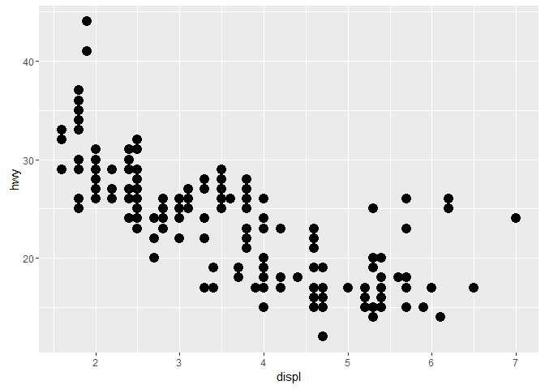

これはあたらしいstatを定義する時ととてもよく似ています。上に示した4つに対してフィールドまたはメソッドを指定する必要があります。

-   `required_aes`はユーザが指定しなければならないすべてのaestheticsを並べたcharacterのベクトルです。
-   `default_aes`は、デフォルト値を持つaestheticsのリストです。

-   `draw_key`は凡例のキーを描画するのに使われる関数を提供します。`?draw_key`を見れば組み込みのkey関数のリストを見ることができます。

-   `draw_group()`は魔法が起こる場所です。この関数は3つの引数を取って、1つのgrid grobを返します。これはそれぞれのパネルに対して1回づつ呼ばれます。 これは以下により詳しく説明しますが、もっとも複雑な部分です。

`draw_group()`は3つの引数を持っています：

-   `data`: それぞれのaestheticsに対してひとつのカラムを持つデータフレーム

-   `panel_scales`: 現在のパネルのxとyのスケールに関する情報を含んだリスト

-   `coord`: 座標系について記述しているオブジェクト

一般的に、`panel_scales`と`coord`が直接使われることはないでしょう。しかし、データを変形させるために常にこれらを使うことになります：`coords <- coord$transform(data, panel_scales)` これは、position変数が0～1の範囲にスケールされたデータフレームを作成します。それから、このデータが返ってきて、grid grob関数が呼び出されます。（非直行座標系での変形はとても複雑です。既存のggplot2のgeomが受け付ける形にデータを変形して、そのgeomに渡すのがいいでしょう）

### 集合的なgeom

`draw_panel()`をオーバーライドするのは、1つの行で1つの要素だけが描画されるなら、もっとも適切なやり方です。他の場合だと、グループごとに要素を描きたくなります。たとえば、多角形を例にとると、各行は多角形の1つの頂点を与えます。この場合には、`draw_group()`をオーバーライドするべきです。

以下は`GeomPolygon`の簡単なバージョンです。

``` r
GeomSimplePolygon <- ggproto("GeomPolygon", Geom,
  required_aes = c("x", "y"),
  
  default_aes = aes(
    colour = NA, fill = "grey20", size = 0.5,
    linetype = 1, alpha = 1
  ),

  draw_key = draw_key_polygon,

  draw_group = function(data, panel_scales, coord) {
    n <- nrow(data)
    if (n <= 2) return(grid::nullGrob())

    coords <- coord$transform(data, panel_scales)
    # A polygon can only have a single colour, fill, etc, so take from first row
    first_row <- coords[1, , drop = FALSE]

    grid::polygonGrob(
      coords$x, coords$y, 
      default.units = "native",
      gp = grid::gpar(
        col = first_row$colour,
        fill = scales::alpha(first_row$fill, first_row$alpha),
        lwd = first_row$size * .pt,
        lty = first_row$linetype
      )
    )
  }
)
geom_simple_polygon <- function(mapping = NULL, data = NULL, stat = "chull",
                                position = "identity", na.rm = FALSE, show.legend = NA, 
                                inherit.aes = TRUE, ...) {
  layer(
    geom = GeomSimplePolygon, mapping = mapping, data = data, stat = stat, 
    position = position, show.legend = show.legend, inherit.aes = inherit.aes,
    params = list(na.rm = na.rm, ...)
  )
}

ggplot(mpg, aes(displ, hwy)) + 
  geom_point() + 
  geom_simple_polygon(aes(colour = class), fill = NA)
```

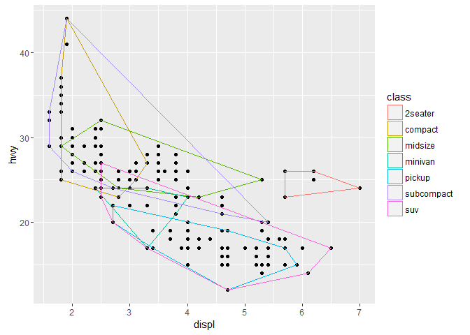

いくつか特筆すべき点があります：

-   1つの行につき1つの多角形を描くのではなく1つのグループにつき1つの多角形を描きたいので、`draw_layer()`の代わりに`draw_group()`をオーバーライドしています。 オリジナルの`GeomPolygon`のソースコードを見たなら、実際には`geom_layer()`をオーバーライドしていることに気づくでしょう。これは`polygonGrob`をつくるためのいくつかの トリックが1回の呼び出しで複数の多角形を生成するからです。これはかなり複雑ですが、パフォーマンスに優れています。

-   もしデータが2つ以下の点しか含まない場合、多角形を描こうとする意味はないので、`nullGrob()`を返します。 これは`NULL`に相当するものです：これは何も描画せず場所も取らないgrobです。

-   単位について注意すべきは、`x`と`y`が「ネイティブな」単位で描かれるという点です（`pointGrob`のデフォルトの 単位はネイティブなので、何も変更する必要はありません）。`lwd`はポイント単位ですが、ggplot2はmm単位を使うので、 修正するための要素`.pt`を掛ける必要があります。

### 既存のgeomからの継承

ときどき、既存のgeomに小さな変更を加えたくなります。この場合、`Geom`を継承するよりも、既に存在するサブクラスを継承することができます。たとえば、`StatChull`と組み合わせてうまく動くように`GeomPolygon`のデフォルトを変更したくなります：

``` r
GeomPolygonHollow <- ggproto("GeomPolygonHollow", GeomPolygon,
  default_aes = aes(colour = "black", fill = NA, size = 0.5, linetype = 1,
    alpha = NA)
  )
geom_chull <- function(mapping = NULL, data = NULL, 
                       position = "identity", na.rm = FALSE, show.legend = NA, 
                       inherit.aes = TRUE, ...) {
  layer(
    stat = StatChull, geom = GeomPolygonHollow, data = data, mapping = mapping,
    position = position, show.legend = show.legend, inherit.aes = inherit.aes,
    params = list(na.rm = na.rm, ...)
  )
}

ggplot(mpg, aes(displ, hwy)) + 
  geom_point() + 
  geom_chull()
```


このやり方では別のgeomをこのstatと組み合わせることはできませんが、凸包がおおむね多角形の機能となったので、ここでは適切だと思われます。

### Exercises

1.  `GeomPoint`と`GeomSimplePoint`を比較しなさい。
2.  `GeomPolygon`と`GeomSimplePolygon`を比較しなさい。

自分のthemeをつくる
-------------------

もし自分の完全なthemeをつくろうとするなら、いくつか知る必要があることがあります：

-   既存のelementに変更を加えるのではなく、オーバーライドする
-   themeの（ほぼ）すべてのelementに影響を与える4つのグローバルなelement
-   完全なelement vs 不完全なelement

### elementのオーバーライド

デフォルトでは、新しいtheme elementを追加すると、既存のテーマから値を継承します。例えば、以下のコードはkeyのcolourを赤に設定していますが、既存のfillを継承しています。

``` r
theme_grey()$legend.key
```

    #> List of 4
    #>  $ fill    : chr "grey95"
    #>  $ colour  : chr "white"
    #>  $ size    : NULL
    #>  $ linetype: NULL
    #>  - attr(*, "class")= chr [1:2] "element_rect" "element"

``` r
new_theme <- theme_grey() + theme(legend.key = element_rect(colour = "red"))
new_theme$legend.key
```

    #> List of 4
    #>  $ fill    : chr "grey95"
    #>  $ colour  : chr "red"
    #>  $ size    : NULL
    #>  $ linetype: NULL
    #>  - attr(*, "class")= chr [1:2] "element_rect" "element"

完全にオーバーライドするには`+`ではなく`%+replace%`を使います。

``` r
new_theme <- theme_grey() %+replace% theme(legend.key = element_rect(colour = "red"))
new_theme$legend.key
```

    #> List of 4
    #>  $ fill    : NULL
    #>  $ colour  : chr "red"
    #>  $ size    : NULL
    #>  $ linetype: NULL
    #>  - attr(*, "class")= chr [1:2] "element_rect" "element"

### グローバルなelement

プロット全体の見え方に影響するelementが4つあります：

| Element | Theme function   | 概要                                                 |
|---------|------------------|------------------------------------------------------|
| line    | `element_line()` | すべての線                                           |
| rect    | `element_rect()` | すべての長方形                                       |
| text    | `element_text()` | すべてのテキスト                                     |
| title   | `element_text()` | タイトル要素（プロット、軸、凡例）のすべてのテキスト |

これらは、より詳細な設定から継承されるデフォルトの属性をセットします。全体のbackgroundの色や全体のフォント設定（familyやsize）を設定するのに便利です。

``` r
df <- data.frame(x = 1:3, y = 1:3)
base <- ggplot(df, aes(x, y)) + 
  geom_point() + 
  theme_minimal()

base
```

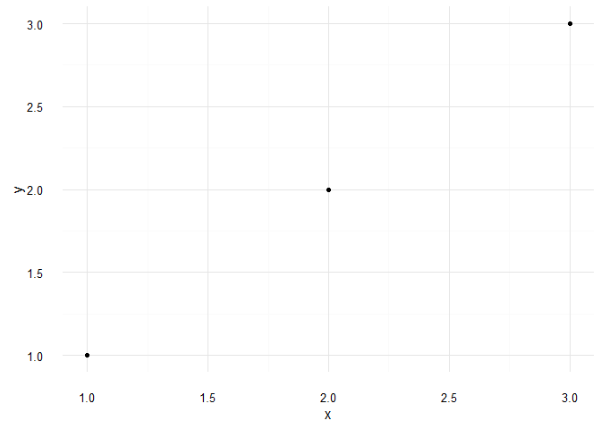

``` r
base + theme(text = element_text(colour = "red"))
```

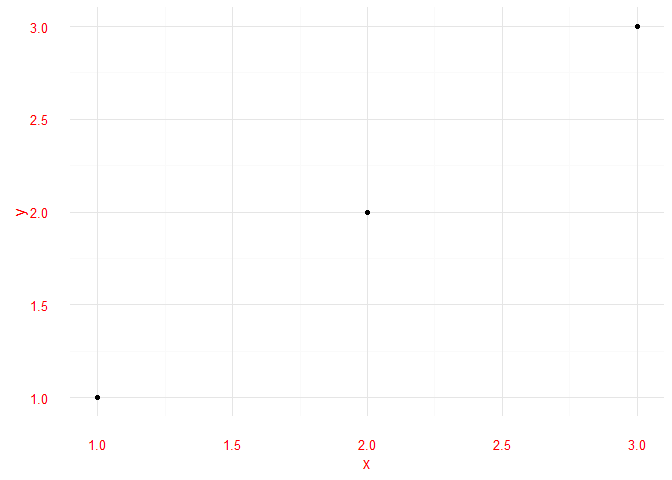

一般的には、これらの値を変更するところからthemeづくりを始めるべきでしょう。

### 完全なelement vs 不完全なelement

完全なthemeオブジェクトと不完全なthemeオブジェクトの違いについて理解するのは有用です。完全なthemeオブジェクトは、`complete = TRUE`を付けてtheme関数を呼び出すことで生成されます。

`theme_grey()`と`theme_bw()`は完全なtheme関数の例です。 `theme()`は不完全なthemeオブジェクトを生成します。なぜなら、それらは、themeオブジェクトの部分的な変更を表すのであって、完全なthemeオブジェクトそれ自体を返すものではないからです。 不完全なthemeと完全なthemeを足し合わせると、完全なthemeｖができます。

完全なthemeと不完全なthemeはggplotオブジェクトに足しあわされた時はやや異なる挙動をします。

-   不完全なthemeを足し合わせると、今のthemeオブジェクトを拡張し、`theme()`の呼び出しに定義されたelementの属性のみを置き換えます。

-   完全なthemeを足し合わせると、既存のthemeを取り除き、新しいthemeを適用します。
